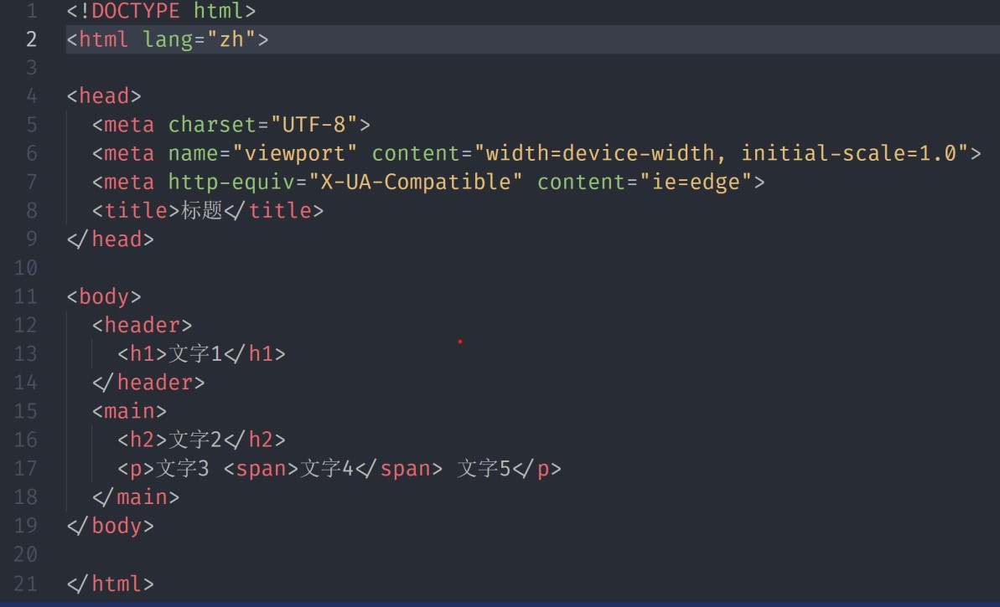
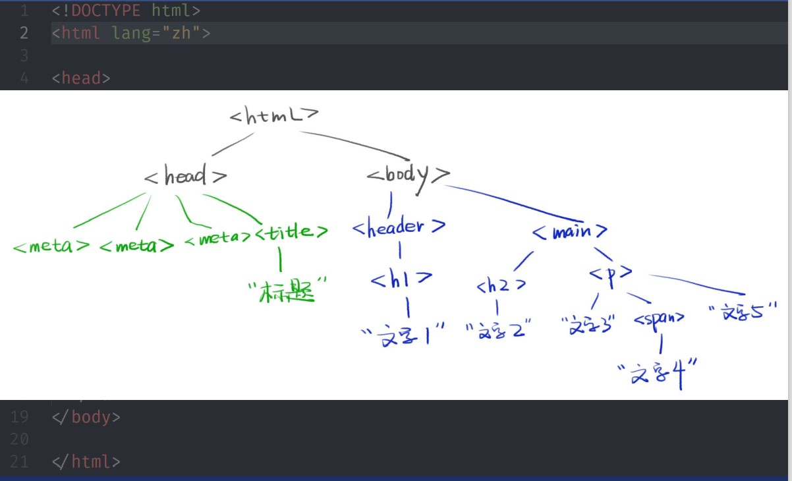

# DOM编程
### 网页其实就是一棵树



### js如何操作这棵树----浏览器往window上加一个document即可
### js用document操作网页----这就是document object model 文档对象类型

### 获取元素,也叫标签
1. 有很多API

* window.idxxx或者直接idxxx
* document.getElementByld('idxxx')
* document.getElementsByTagName('div')[0](第0个div元素)
* document.getElementsByClassName('red')[0]
* document.querySelector('#idxxx')
* document.querySelectorAll('.red')[0]

2. 用哪一个

* 工作中用querySelector 和querySelectorALL
* 做demo直接用idxxx(自己做的时候)
* 要兼容ie的才用getElement(s)Byxxx

### 获取特定元素
1. 获取html元素

* document.documentElement
2. 获取head元素
*  document.head
3. 获取body元素

* document.body

4. 获取窗口(窗口不是元素)

* window

5. 获取所有元素

* document.all
* 这个document.all是第六个falsy值

### 获取到的元素是一个对象----搞清原型

1. 用div对象来看看----console.log(div1)看原型链

* 第一层原型是[HTMLDivElement.prototype](https://developer.mozilla.org/zh-CN/docs/Web/API/HTMLDivElement) 这里面是所有div共有的属性
* 第二层原型[HTMLElement.prototype](https://developer.mozilla.org/zh-CN/docs/Web/API/HTMLElement)这里面是所有html标签共有属性
* 第三层原型Element.prototype----这里面是所有xml,html标签的共有属性
* 第四层原型 node.prototype----这里面是所有节点共有的属性,节点xml标签文本注释,html标签文本注释等
* 第五层原型EventTarget.prototype----里面最重要的函数属性addEventListener
* 最后一层原型就是object.prototype

### div完整原型链----自身属性和共有属性 

### 分清节点和元素
1. 节点node包括以下几种
* mdn有[完整描述](https://developer.mozilla.org/zh-CN/docs/Web/API/Node/nodeType),x.nodeType得到一个数字
* 1表示元素Element,也叫标签Tag
* 3表示文本text
* 8表示注释comment
* 9表示文档document
* 11表示文档片段documentFragment
* 记住1和2即可

### 节点的增删改查

1. 增

* 创建一个标签节点
```
let div1=document.createElement('div')
document.createElement('style')
document.createElement('script')
document.createElement('li')
```
2.  创建一个文本节点
* text1 = document.createTextNode('你好')

3. 标签里面插入文本

* div1.appendchild(text1)
* div.innerText = '你好'或者div1.textContent = '你好'
* 但是不能用div1.appendChild('你好')

4. 插入页面中

* 你创建的标签默认处于js线程中
* 你必须把它插到head或者body里面,她才会生效
* document.bodt.appendChild(div)
* 或者已经在页面中的元素.appendChild(div)

### appendChild
1. 代码

* 页面中有div#test1和div#test2
* let div = document.createElement('div')
* test1.appendChild(div)
* test2.appendChild(div)

2. 问最终div出现在哪里?

* test1里面
* test2里
* test1和test2里
* 答案test2里----一个元素不能出现在两个地方,除非复制一份


### 删
1. 两种方法

* 旧方法: parentNode.childChild(childNode)
* 新方法: childNode.remove()

2. 思考

* 如果一个node被移出页面(dom树)
* 还能再次回到页面中吗----可以的

### 改属性
1. 写标准属性

```
改class : div.className = 'red blue'(全覆盖)
改class:div.classList.add('red')
改style:div.style = 'width:100px;color:blue;'
改style的一部分: div.style.width = '200px'
大小写: div.style.backgroundColor = 'white'
改data-* 属性 : div.dataset.x = 'frank'

```
2. 读标准属性
* div.classList/a.href
* div.getAttribute('class')/a.getAttribute('href')
* 两种方法都可以,但值可能稍微有些不同

### 改事件处理函数
1. div.onclick默认为null

* 默认点击div不会有任何事情发生
* 但是如果你把div.onclick改为一个函数fn
* 那么点击div的时候,浏览器就会调用这个函数
* 并且是这样调用的fn.all(div,event)
* div会被当做this
* event则包含了点击事件的所有信息,如坐标

2. div.addEventListener

* 是div.onclick的升级版

### 改内容
1. 改文本内容

* div.innerText = 'xxx'
* div.textContent = 'xxx'
* 两者几乎没有区别

2. 改html内容

* div.innerHTML = '<strong >重要内容</strong>'

3. 改标签

* div.innerHTML = " //再加内容


### 改爸爸
* 想要一个新爸爸?
* newParent.appendChild(div)
* 直接就这样可以了,直接从原来的地方消失

### 查
1. 查爸爸

* node.parentNode 或者node.parentElement

2. 查爷爷

* node.parentNode.parentNode

3. 查子代

* node.childNodes或者node.children
* 当子代变化是,两者也会实时 变化

4. 查兄弟姐妹

* node.parentNode.childNodes还要排除自己
* node.parentNode.children还要排除自己

5. 查看老大

* node.firstChild

6. 查看老幺

* node.lastChild

7. 查看上一个哥哥/姐姐

* node.previousSibling

8. 查看下一个弟弟/妹妹

* node.nextSibling


9. 遍历一个div里面的所有元素
```
 travel = (node,fn) => {
 fn(node)
 if(node.children){
 for(let i=0;i<node.children.length;i++){
  travel(node.children[i],fn)
  }
  }
  }
  travel(div,(node) => console.log(node))
```

