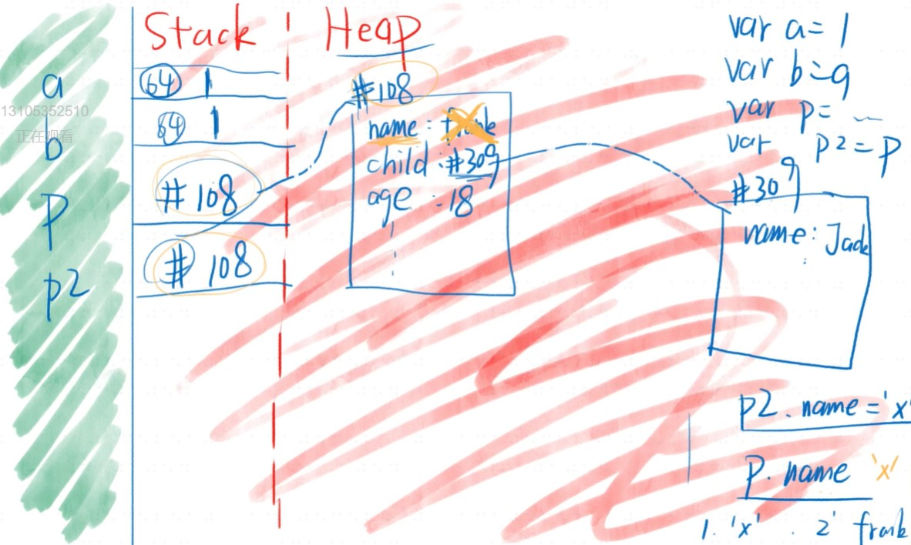

### 如何统计自己代码行数
1. 终端安装 yarn global add cloc
2. colc --vcs=git . 
3. 可以用来统计一个仓库
4. 注意
5. 如果仓库有node_modules目录等不相关内容
6. 需要把/node_modules/写入gitignore文件

### 英语课堂
* Opearting System 操作i系统,简称os kernel 内核
* runtime 运行时(需要的东西), compile 编译
* environment 环境,简称env  ,,memory记忆,存储
* person 一个人  people 一群人

### 打开浏览器
1. chrome.exe
* 双击chrome图标,然后运行chrome.exe文件
* 开启chrome进程,作为主进程
* 主进程会开启一些辅助进程,如网络服务,gpu加速
* 每新建一个网页,就有可能会开启一个子进程

2. 浏览器的功能
* 发起请求,下载html,解析html,下载css,解析css,渲染界面,下载js,解析js,执行js等
* 功能模块:用户界面,渲染引擎,js引擎,存储等
* 上面模块一般各处于不同的线程(比进程更小)
* 如果进程是车间,线程相当于车间里的流水线

### js引擎
1. js引擎举例
* chrome用的是v8引擎,c++编写
* 网景用的是spiderMonkey,后被firefox使用,c++编写
* safari用的是javascriptcore
* ie用的是chakra(jscript9)
* edge用的是chakra(javascript)
* node.js用的是v8引擎

2. 主要功能
* 编译:把js代码翻译为机器能执行的字节码或机器码
* 优化:改写代码,使其更高效
* 执行:执行上面的字节码或者机器码
* 垃圾回收:把js用完的内存回收,方便下次使用*

### 执行js代码
1. 准备工作
* 提供api:window/document(文件)/setTimeout
* 上面这些不是js自身具备的功能
* 将这些功能称为运行环境-runtime env
* 一旦把js放进页面,就开始执行js
* js代码在内存里运行

### 内存图 
### 红色区域
1. 作用
* 红色专门用来存放数据
* 红色区域并不存变量名,变量名在[不知什么区]
* 每种浏览器的分配原则并不一样
* 图片区域不完整,还有调用栈,任务队列等区域

2. stack和heap
* 红色区域分为stack栈和heap堆
* stack区特点:每个数据顺序存放
* heap区特点,每个数据随机存放

### stack,heap图 
* 代码举例
```
var a = 1
var b = a
var person = {name:'frank',child:{name:'jack'}}
var person2 = person
```
* 规律
* 数据分两种:非对象和对象
* 非对象存放在stack-非对象有数字,字符串,
* 对象存放在heap
* =号总是会把右边的东西复制到左边(不存在什么传值和传址)