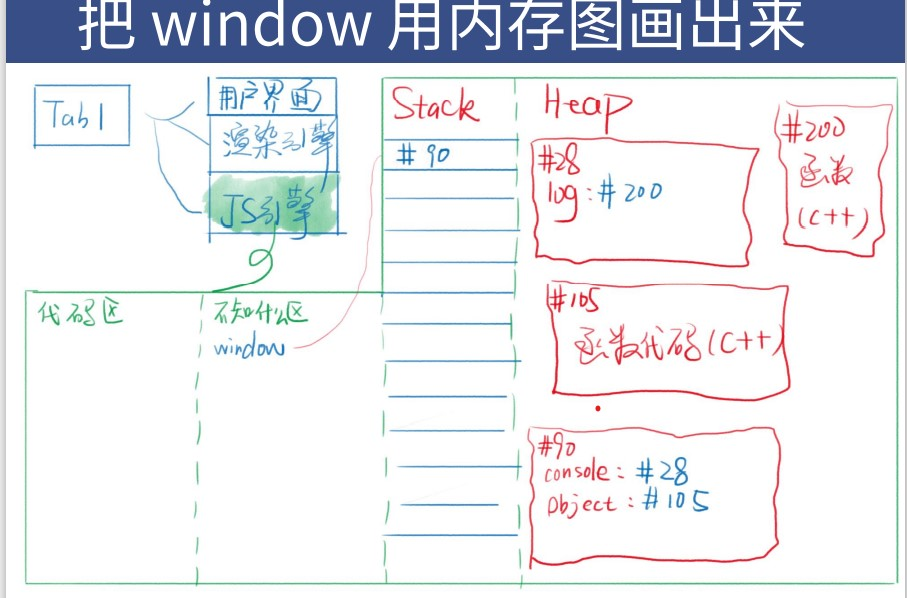
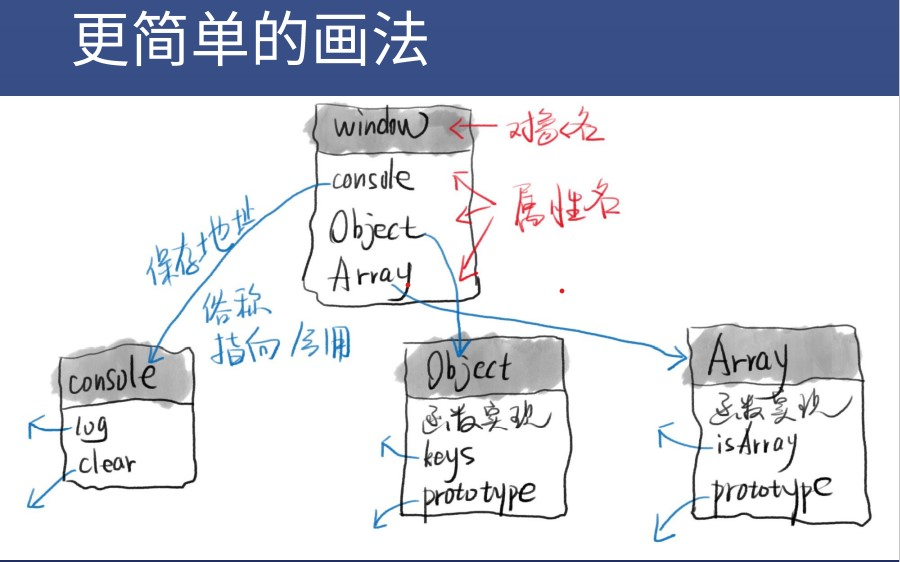
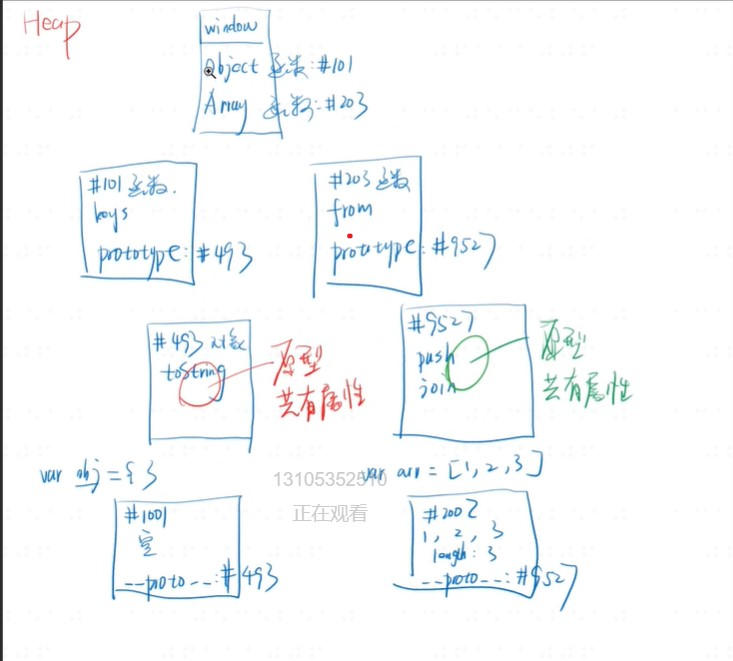

### js开发要有window(浏览器提供)
* 还需要什么
* 要有console,并且挂在window上,window.console
* 有document,并且挂在window上,window.document
* 要有对象-object,并且挂在window上,var person = {}等价于var person = new object()
* 要有数组(一种特殊的对象),就有了Array,并且挂在window,var a = [1,2,3]等价于var a = new Array(1,2,3) 
* 有函数(一种特殊对象),就有了Function,并且挂在window上,function f(){}等价于var f = new Function()
* 挂在window上方便使用

### console.dir (window.console)

* 
* 
### window细节
* 关于window
* window变量和window对象是两个东西
* window变量是一个容器,存放window对象的地址
* window对象是Heap里的一坨数据
* 可以用var x = window  那么这个x就可以指向window对象,代替window
### 同理
* console和console对象不是同一个东西
* Object和Object函数对象不是同一个东西
* 前者是内存地址,后者是一坨内存

## 原型链****
* 只关心小写字母的隐藏属性例如obj 关心大写Object的prototype
* 隐藏属性是 __proto__
* prototype和__proto__的区别 ,都存着原型的地址,不过prototype挂在函数上例如大写Object上,__proto__挂在每个新生成的对象上例如小写obj上

* 