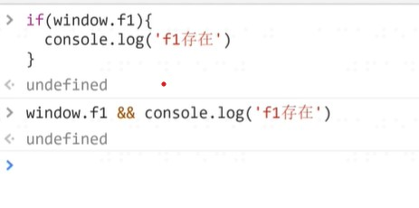
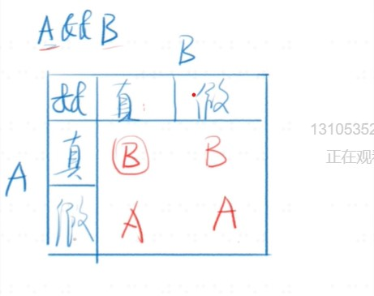

# 表达式和语句
* 只有函数有返回值
### 表达式
* 1+2表达式的值为3
* add(1,2)表达式的值为函数的返回值
* console.log表达式的值为函数本身
* console.log(3)表达式的值

### 语句
* var a=1是一个语句

### 二者的区别
* 表达式一般都有值,语句可能有可能没有
* 语句一般会改变环境(声明,赋值)
* 这两句并不是绝对的

### 大小写不要写错
* var a 和var A 是不同的

### 大部分空格没有实际意义
* var a=1 和var a = 1没有区别
* 只有一个地方不能加回车,那就是return后面

### 标识符
1.  规则
* 第一个字符,可以是Unicode字母或$或_或中文
* 后面的字符,除了上面所说的,还可以有数字
2.  变量名是标识符
* var _=1
* var$=2
* var______=6
* var 你好='hi'

### 注释
1. 不好的注释

* 把代码翻译成中文
* 过时的注释
* 发泄不满的注释

2. 好的注释

* 踩坑注释
* 为什么代码会写的这么奇怪,遇到什么bug

### 区块block
1.  把代码包在一起

```
{
    let a =1
    let b =2
}
```
2. 常常于if/for/while和用

### if语句
1. 语法

* if(表达式){语句1}else{语句2}
* {}在语句只有一句的时候可以忽略,不建议这样做

2. 特殊情况

* 表达式里可以非常变态, 如a=1
* 语句1里可以非常变态,如嵌套的if else
* 语句2里可以非常变态,如嵌套的if else
* 缩进也可以变态,如面试题常常下套

``` 
a=1
if(a === 2)
   console.log('a')
   console.log('a等于2')
   ```


### 最推荐使用的写法
```
if(表达式) {
    语句
} else if (表达式) {
    语句
} else {
    语句
}
```
### 次推荐使用的写法
```
function fn(){
    if (表达式) {
        return 表达式
    }
if (表达式) {
    return 表达式
}
return 表达式
}
```
## switch语句
* if... else... 升级版
1. 语法
```
 switch (fruit) {
     case "banana":
     // ...
     break;
     case "apple":
     // ...
     break;
     default:
     //...
 }
```
2. break

* 大部分时候,省略break就完了
* 少部分时候,可以利用break

### 问好冒号表达式
* 表达式1?表达式2:表达式3

### &&短路逻辑
* A && B && C && D 取第一个假值或D ,并不取true/false

### || 短路逻辑
* A || B || C ||D 取第一个真值或D,并不会取true/false

### 总结
* 条件语句
* if...else
* switch
* A?B:C
* A&&B
* fn && fn()
* A || B 
* A=A || B

### while 循环(当...时)
1. 语法

* while(表达式){语句}
* 判断表达式的真假
* 当表达式为真,执行语句,执行完再判断表达式的真假
* 当表达式为假,执行后面的语句

2. 其他
* do...while用的不多

### for循环--是while循环的方便写法
1. 语法

```
 for(语句1;表达式2;语句3){
     循环体
 }
```
* 先执行语句1
* 然后判断表达式2
* 如果为真,执行循环体,然后执行语句3
* 如果为假,直接退出循环,执行后面的语句

### break和continue 
* 退出所有循环 vs 退出当前一次循环
### label语句-用的很少,面试可能会考
1. 语法

```
foo: {
    console.log(1);
    break foo;
    console.log('本行不会输出');
}
console.log(2);
```
2. 面试

```
{
    foo: 1
}
```
* 上面是什么东西

### 推荐书籍
* 元一峰教程(入门) --链接[网址](https://wangdoc.com/es6/)
* <(<你不知道的JavaScript(上卷)>>--[链接](https://book.douban.com/subject/26351021/)
* 两个式子(相同意思
* 如果AB都为真 则值为B,如果A假B真,则值为A,若A真B假则值为B,若AB都为假则值为A