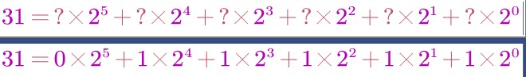
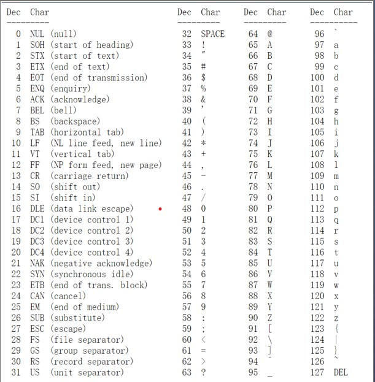
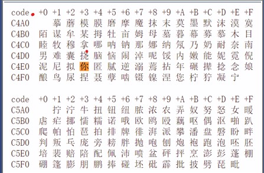
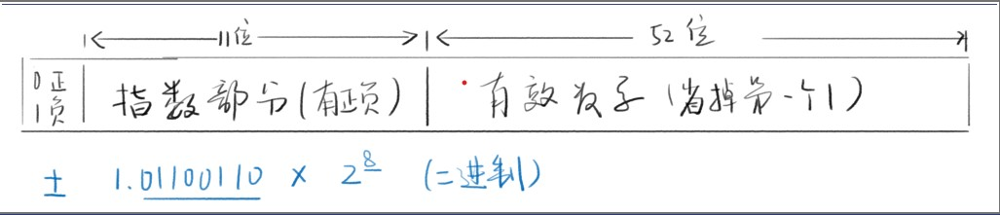

# 数字和字符串
### 都是一，为什么要分 1 和 '1'
1. 功能不同
* 数字是数字，字符串是字符串，要严谨
* 数字能加减乘除，字符串不行
* 字符串能表示电话号码，数字不行
2. 存储形式不同
* JS 中，数字是用 64 位浮点数的形式存储的
* JS 中，字符串是用类似 UTF8 形式存储的（UCS-2）
### 如何存数字-十进制转二进制即可
1. 10 转 2
* 31 变成二进制 
* 所以 31(十进制) = 01 1111(二进制)
2. 2转10

* 100011 变成十进制
* 每一位乘以 2 的 N 次方，然后加起来即可
* 100011 = 2^5 + 2^1 + 2^0 = 35

### 用十六进制表示二进制
* 为什么用十六进制
* 因为二进制写起来太慢了：011110001011010
* 记住 8 4 2 1 对应 X X X X
* 从右往左每四位改写成一位： 011110001011010
* 得到 3,12,5,10；把大于9的数字改为ABCDEF
* 于是得到 3C5A，你也可以用计算器的程序员模式
* HEX 表示 16 进制，BIN 表示 2 进制
* OCT 表示 8 进制，DEC 表示 10 进制

### 如何存字符
* 转成数字,注意'1'不能用1来表示

### 用0~127表示所有符号
* 
* 0 表示结束字符
* 10 表示换行
* 13 表示回车
* 32 表示空格
* 33到47表示标点
* 48到57表示数字符号
* 65到90表示大写字母
* 97到122表示小写字母
* 127表示删除键

### 中国国家标准局来编，名称为「国标2312」来表示中文
* 用 0000~FFFF 表示汉字
* 
* 一个16进制数是4个0/1位
* FFFF就是4x4=16位，也就是两个字节
* 最多收录 2^16 = 65536 个字符
* 但只收录了 6000 多汉字、西文字母和日文假名
* 记住48代表0 65代表A,97代表a

* 「你」的 GB2312 编号为 C4E3
* 「牛」的 GB2312 编号为 C5A3

### 微软推出了一个国标扩展，简称GBK
### 万国码 Unicode
1. 优点
* 已收录 13 万字符（大于 16 位），全世界通用
* 以后还会继续扩充，不会停止
* 最新版只添加了一个字——令和的合体字
2. 缺点
* 两个字节不够用，每个字符要用三个及以上字节
* 这样所有文件都扩大 50%，不划算
* 那怎么办？

### 虽然用 Unicode但存的时候偷懒,UTF-8 就被发明出来了
1. 巧妙的存法
* 存储a
* a 对应的 Unicode 编号为 97，十六进制为 61
* Unicode 直接存： 0000000000000000‭01100001‬
* UTF-8偷懒存法： 01100001
* 三字节变一字节，比GBK 还省

2. 存储「你」
* 你对应的 Unicode 编号为 4F60
* Unicode 直接存： 00000000‭0100111101100000‬
* UTF-8偷懒存法： ‭111001001011110110100000‬
* 还是三字节，没有省，但是字母都能省一点
3. UTF-8 中的 8 的意思是
最少可用 8 位存一个字符

### utf-8 规则
* 以「你a」为例
* 11100100101111011010000001100001
* 如何知道上述内容表示什么字符？
* 读 8 位信息 11100100
* 发现开头有 3 个 1，说明这个字符有 3 个八位
* 于是再读两个 8 位信息 10111101 10100000
* 前面的 10 不要，其他合起来，得 0100111101100000
* 这就还原为 Unicode 的你了：
* 000000000100111101100000 
* 再读 8 为信息 01100001
* 发现开头是 0，说明这个字符只占 8 位
* 这就还原味 Unicode 的 a 了：
* 000000000000000001100001

## js中的数据类型
1. 七种
* 数字 number
* 字符串 string
* 布尔 bool
* 符号 symbol
* 空 undefined
* 空 null
* 对象 object
* 总结：四基两空一对象

2. 不是数据类型

* 数组、函数、日期
* 它们都属于 object 

### number-64位浮点数
1.  写法
* 整数写法 - 1
* 小数写法- 0.1
* 科学计数法- 1.23e4
* 八进制写法- 0123或00123或 0o123
* 十六进制- 0x3f或0X3f
* 二进制-0b11或0B11

2. 特殊值
* 正0和负0 ,都等于0,要严谨
* 无穷大 infinity,+infinity,-infinity 负无穷
3. 无法表示的数字

* NaN(not a number)
* 但他是一个数字

### 64位浮点数
1. JS数字的存储形式
* 浮点就是浮动的点，意思就是小数点会乱动
* 123.456 可以表示为 1.23456e10^2
* 也可以表示为 12345.6e10^-2
* 

2. 64位存储一个 number
* 符号占 1 位
* 指数占 11 位（-1023~1024）
* 有效数字占 52 位（开头的 1 省略）

### 范围和精度
1. 范围（忽略符号位）
* 指数拉满、有效数字拉满，得到最大二进制数字
* Number.MAX_VALUE: 1.7976931348623157e+308
* 指数负方向拉满、有效数字最小1，得到最小值
* Number.MIN_VALUE: 5e-324
2. 精度（有效数字）
* 最多只能到52+1个二进制位表示有效数字
* 2^53 对应的十进制是 9 后面 15 个零
* 所以15位有效数字都能精确表示
* 16位有效数字如果小于 90 开头，也能精确表示
* 9110000000000001 就存不下来

### 字符串 string-每个字符两个字节
1. 写法

* 单引号-'你好'
* 双引号-"你好"
* 反引号-\`你 好 `
* 注意-引号不属于字符串的一部分，就像书名号不属于书名的一部分一样
2. 转义
* 错误写法----'it's ok' 
JS 引擎会认为 'it' 就结束了，后面的看不懂
* 正确写法----
* 'it\'s ok'  // 这就是转义 在t后面加\ (md显示不出来)
* "it's ok"
* \`it's ok`
3. 用另一种写法表示你想要的东西(背下来)

* \' 表示 '
* \" 表示 "
* \n 表示换行
* \r 表示回车
* \t 表示 tab 制表符
* 两个\ 表示 \
* \uFFFF 表示对应的 Unicode 字符
* \xFF 表示前 256 个 Unicode 字符

4. 多行字符串
* 如果你想要在字符串里回车
```
 let s = `这样是
可以的
用反引号很容易做到`
```
4. 字符串长度

* string.length
* '123'.length // 3
* '\n\r\t'.length // ?
* ''.length // 0
* ' '.length // 1(''里面有空格)

5. 通过下标读取字符

 ``` 
 string[index]
 let s = 'hello';
s[0] // "h"
```
* 注意index从0开始,s[0]是第一个字符
* 注意index到length
```
let s = 'hello';
s[5] // undefined，居然不报错
s[4] // 'o'
```

6. base64 转码 

* window.btoa(控制台输入)-正常字符串转为 Base64 编码的字符串
* window.atob-Base64 编码的字符串转为原来的字符串
* 一般用来隐藏招聘启事里的简历

### 布尔boolean----只有两个值true\false,注意大小写

1. 下列运算符会得到 bool 值

* 否定运算----!value
* 相等运算----1 == 2、1 != 2、3 === 4、3 !== 4
* 比较运算----1 > 2、1 >= 2、3 < 4、3 <= 4
2. if 配 bool

* if 语句常常需要判断真假-if( value ) { ... } else { ... }
* 如果 value 是 bool 值还好说
* 如果 value 不是 bool 值咋办，谁真谁假
* 1 是真还是假，0 是真还是假
* '1' 是真还是假，'0' 是真还是假

3. 五个 falsy 值

* falsy 就是相当于 false 但又不是 false 的值
分别是1. undefined 2.  null 3.  0  4.  NaN    5.  ''
* 注意''和' '不一样

### undefined 和 null 两种空类型
1. 区别

* 没有本质区别
* 细节一
如果一个变量声明了，但没有赋值，那么默认值就是 undefined，而不是 null
* 细节二
如果一个函数，没有写 return，那么默认 return undefined，而不是 null
* 细节三
前端程序员习惯上，把非对象的空值写为 undefined，把对象的空值写为 null
但仅仅是习惯上而已

### symbol 符号 -不常用 --教程链接[链接](https://zhuanlan.zhihu.com/p/22652486)

### 变量声明
1. 三种声明方式

* var a = 1 
* let a = 1 
* const a = 1
* a = 1

2. 区别

* var 是过时的、不好用的方式
* let 是新的，更合理的方式
* const 是声明时必须赋值，且不能再改的方式
* 最后这种方式是错误的，不准这样声明

3. var变量提升  教程[网址](https://wangdoc.com/javascript/basic/grammar.html#%E5%8F%98%E9%87%8F%E6%8F%90%E5%8D%87)

### var声明 -----写代码不用var
### let声明 -----
1. 规则

* 遵循块作用域，即使用范围不能超出 { }
* 同一作用域里,不能重复申明
* 可以赋值，也可以不赋值
* 必须先声明再使用，否则报错
* 全局声明的 let 变量，不会变成 window 的属性
* for 循环配合 let 有奇效

### const声明
* 规则
* 跟 let 几乎一样
* 只有一条不一样：声明时就要赋值，赋值后不能改

### 变量声明
1. 指定值  

* var a=1

2. 同时也指定了类型

* var a=1

3. 但是值和类型 都是可以随意变化的

* a=2
* a='字符串'

### name 和'name'的区别
1. name是变量

* 值可变,可能是'name',也可能是'hello'

2. 'name'是字符串常量

* 常量就是不变量
* 'name'只能是'name',不能是其他值

### 总结 
1. 六种类型
* undefined
* null
* number
* string
* bool
* symbol

2. 这些都是简单类型----只有object是复杂类型

### 类型转换
*  number => string(字符串)
1.  String(n)
2.  n + ''
*  string => number
1.  Number(s)
2.  parseInt(s) / parseFloat(s)
3.  s - 0
4.  +s
*  x => bool
1.  Boolean(x)
2.  !!x
*  x => string
1.  String(x)
2.  x.toString()

### 新增bigint  [网址](https://developer.mozilla.org/zh-CN/docs/Web/JavaScript/Reference/Global_Objects/BigInt)


