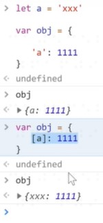
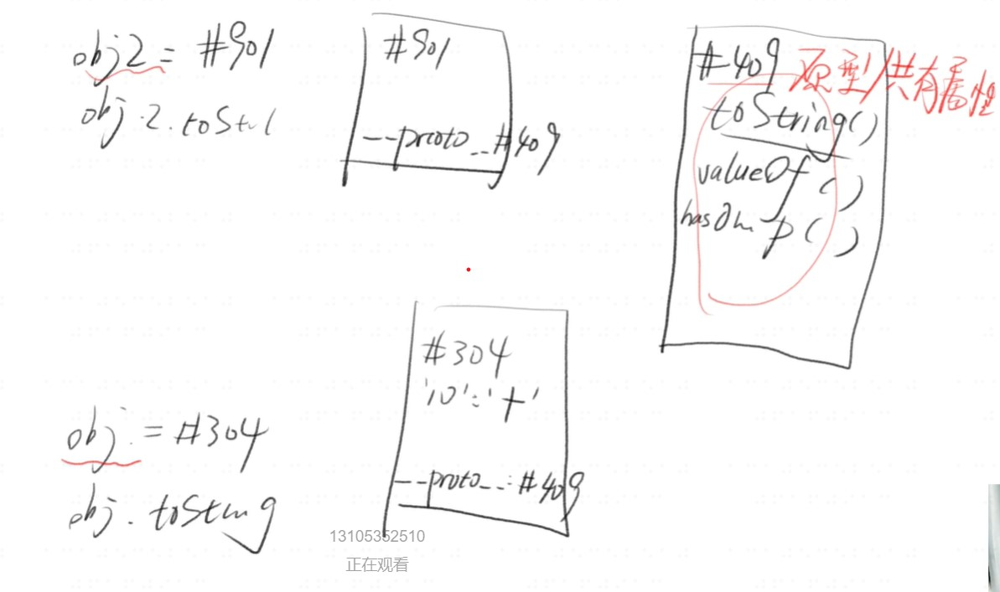
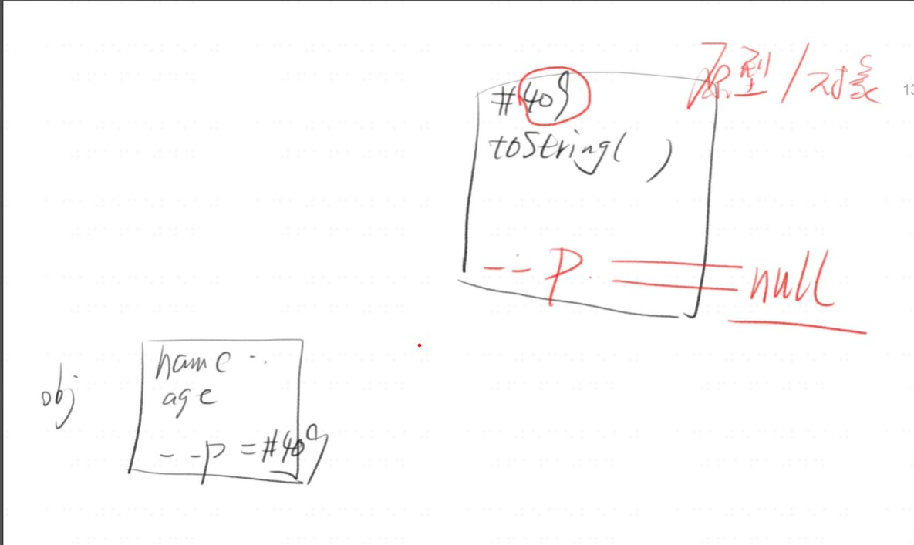
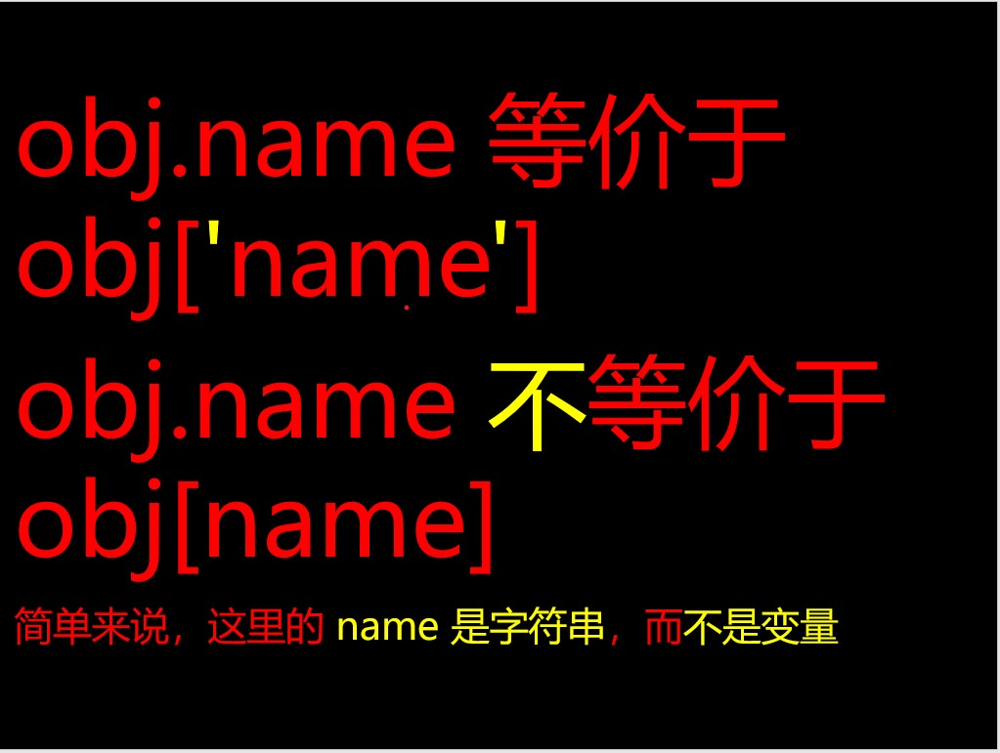
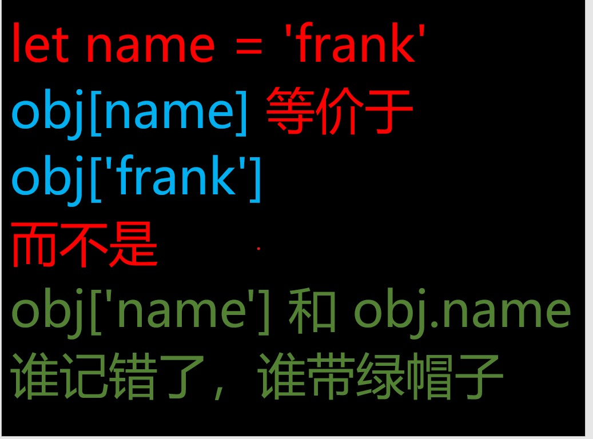

# object
1. 定义

* 无序的数据集合
* 键值对的集合
2. 写法

* let obj = { 'name': 'frank', 'age': 18 }
* let obj = new Object({'name': 'frank'})
* console.log({ 'name': 'frank, 'age': 18 })
3. 细节

* 键名是字符串，不是标识符，可以包含任意字符
* 引号可省略，省略之后就只能写标识符
* 就算引号省略了，键名也还是字符串（重要）
4. 每个 key 都是对象的属性名（property）---- 'name'就是属性名
5. 每个 value 都是对象的属性值-----''frank'就是属性值
6. 奇怪的属性名

* 所有属性名会自动变成字符串
```
let obj = {
  1: 'a',
  3.2: 'b',
  1e2: true,
  1e-2: true,
  .234: true,
  0xFF: true
};
```
```
Object.keys(obj)
=> ["1", "100", "255", "3.2", "0.01", "0.234"]
//查看key的值
```
* 细节----Object.keys(obj) 可以得到 obj 的所有 key

### 变量作属性名
1. 如何用变量做属性名
* 之前都是用常量做属性名
* let p1 = 'name'
* let obj = { p1 : 'frank'} 这样写，属性名为 'p1'
* let obj = { [p1] : 'frank' } 这样写，属性名为 'name' ----因为加上[]
* 

2. 对比

* 不加 [ ] 的属性名会自动变成字符串
* 加了 [ ] 则会当做变量求值
* 值如果不是字符串，则会自动变成字符串
### 对象的隐藏属性
1. 隐藏属性
* JS 中每一个对象都有一个隐藏属性
* 这个隐藏属性储存着其共有属性组成的对象的地址
* 这个共有属性组成的对象叫做原型
* 也就是说，隐藏属性储存着原型的地址

2. 代码示例

```
var obj = {}
obj.toString() // 居然不报错
因为 obj 的隐藏属性对应的对象上有 toString()
```
* 图

* 除了字符串,symbol也能做属性名

```
let a = symbol()
let obj = {[a] : 'hello' }
```
* 在迭代时能用到

# 增删改查

### 删除属性

1. delete obj.xxx 或 delete obj['xxx']
* 即可删除 obj 的 xxx 属性
* 请区分「属性值为 undefined」和「不含属性名」
2. 不含属性名
* 'xxx' in obj === false
3. 含有属性名，但是值为 undefined
* 'xxx' in obj && obj.xxx === undefined
4. 注意 obj.xxx === undefined
* 不能断定 'xxx' 是否为 obj 的属性
5. 类比
* 你有没有卫生纸？
* A: 没有 // 不含属性名
* B: 有，但是没带 // 含有属性名，但是值为 undefined

### 查看所有属性
1. 查看自身所有属性
* Object.keys(obj)---obj为属性名
2. 查看自身+共有属性
* console.dir(obj)
3. 或者自己依次用 Object.keys 打印出 obj.__ proto__
4. 判断一个属性是自身的还是共有的
* obj.hasOwnProperty('toString')
### 原型
1. 每个对象都有原型
* 原型里存着对象的共有属性
* 比如 obj 的原型就是一个对象
* obj.__ proto__ 存着这个对象的地址
* 这个对象里有 toString / constructor / valueOf 等属性
2. 对象的原型也是对象
* 所以对象的原型也有原型
* obj = {} 的原型即为所有对象的原型
* 这个原型包含所有对象的共有属性，是对象的根
* 这个原型也有原型，是 null
*  

### 查看属性
1. 两种方法查看属性
* 中括号语法：obj['key'] 
* 点语法：obj.key
* 坑新人语法：obj[key] // 变量 key 值一般不为 'key'
2. 请优先使用中括号语法
* 点语法会误导你，让你以为 key 不是字符串
* 等你确定不会弄混两种语法，再改用点语法

### 
### 

### 看你分清变量 name 和常量字符串 'name' 没有
```
let list = ['name', 'age', 'gender']
let person = {
       name:'frank', age:18, gender:'man'}
for(let i = 0; i < list.length; i++){
  let name = list[i]
  console.log(person__???__)
}
使得 person 的所有属性被打印出来
```
* 选项
* console.log(person.name)
* console.log(person[name])
* 第二正确----name是个变量


## 修改或增加属性(写属性)
1. 直接赋值

```
1.let obj = {name: 'frank'} // name 是字符串
2.obj.name = 'frank' // name 是字符串
3.obj['name'] = 'frank' 
4.obj[name] = 'frank' // 错，因 name 值不确定
6.obj['na'+'me'] = 'frank'
5.let key = 'name'; obj[key] = 'frank'
7.let key = 'name'; obj.key = 'frank' // 错
因为 obj.key 等价于 obj['key']
```
2. 批量赋值----Object.assign(obj, {age: 18, gender: 'man'})

### 修改和增加共有属性
1. 无法通过自身修改或增加共有属性
* let obj = {}, obj2 = {} // 共有 toString
* obj.toString = 'xxx' 只会在改 obj 自身属性
* obj2.toString 还是在原型上
2. 我偏要修改或增加原型上的属性
* obj.__ proto__.toString = 'xxx' // 不推荐用 __proto __
* Object.prototype.toString = 'xxx' //推荐使用
* 一般来说，不要修改原型，会引起很多问题

### 修改隐藏属性

1. 不推荐使用 __proto __
* let obj = {name:'frank'}
* let obj2 = {name: 'jack'}
* let common = {kind: 'human'}
* obj.__proto __ = common
* obj2.__proto __ = common
2. 推荐使用 Object.create
* let obj = Object.create(common)
* obj.name = 'frank'
* let obj2 = Object.create(common)
* obj2.name = 'jack'
* 规范大概的意思是，要改就一开始就改，别后来再改

### 总结
1. 删
* delete obj['name']
* 'name' in obj // false
* obj.hasOwnProperty('name')  // false
2. 查
* Object.keys(obj)
* console.dir(obj)
* obj['name']
* obj.name // 记住这里的 name 是字符串
* obj[name]  // 记住这里的 name 是变量
3. 改
* 改自身 obj['name'] = 'jack'
* 批量改自身 Object.assign(obj, {age:18, ...})
* 改共有属性 obj.__ proto__['toString'] = 'xxx'
* 改共有属性 Object.prototype['toString'] = 'xxx'
* 改原型 obj.__ proto__ = common
* 改原型 let obj = Object.create(common)
* 注：所有 __ proto__ 代码都是强烈不推荐写的
4. 增
* 基本同上：已有属性则改；没有属性则增。


