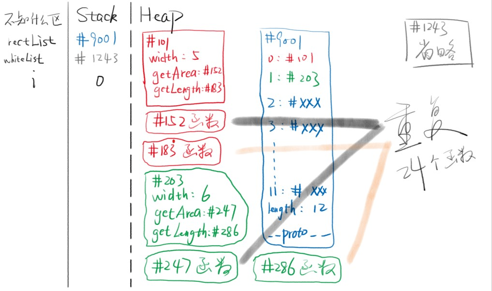
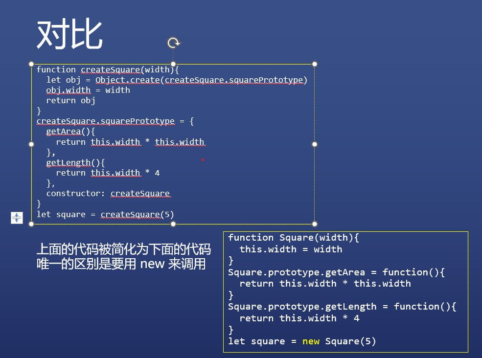
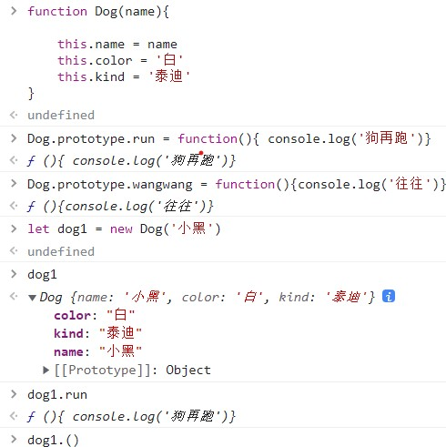

# js对象分类
### 课外阅读链接
* 可以不会 class，但是一定要学会 prototype [链接](https://zhuanlan.zhihu.com/p/35279244)
* JS 的 new 到底是干什么的？[链接](https://zhuanlan.zhihu.com/p/23987456)
* JS 中 __proto __ 和 prototype 存在的意义是什么？[链接](https://www.zhihu.com/question/56770432/answer/315342130)
* es6新特性[链接](https://fangyinghang.com/es-6-tutorials/)

### 做一个小程序---输出各种形状的面积和周长
```
let square = {
  width: 5,
  getArea(){ 
    return this.width * this.width 
  },//area是面积
  getLength(){
    return this.width * 4
  }//length是周长
}
```
* 正方形拥有三个属性：边长、面积、周长

2. 要是输出十二个正方形呢?

```
let square = {
  width: 5,
  getArea(){ 
    return this.width * this.width 
  },
  getLength(){
    return this.width * 4
  }
}
let square2 = {
  width: 6,
  getArea(){ 
    return this.width * this.width 
  },
  getLength(){
    return this.width * 4
  }
}
let square3 = { ...
```
* 一个又一个输出,傻子写的代码

3. 用for循环试一下

```
let squareList = []
for(let i = 0; i<12; i++){
  squareList[i] = {
    width: 5,
    getArea(){ 
      return this.width * this.width 
    },
    getLength(){
      return this.width * 4
    }
  }
}
```
* 实现了 ,但是width不全是5怎么麽办

4. 声明一下

```
let squareList = []
let widthList = [5,6,5,6,5,6,5,6,5,6,5,6]
for(let i = 0; i<12; i++){
  squareList[i] = {
    width: widthList[i],
    getArea(){ 
      return this.width * this.width 
    },
    getLength(){
      return this.width * 4
    }
  }
}
```
* 搞定了,但是还是垃圾代码,因为浪费了太多内存 ,重复调用周长和面积   
* 画一下内存图 

5. 可以借助原型----将12个对象的共有属性放在原型里

```
let squareList = []
let widthList = [5,6,5,6,5,6,5,6,5,6,5,6]
let squarePrototype = {
  getArea(){ 
    return this.width * this.width 
  },
  getLength(){
    return this.width * 4
  }
}
for(let i = 0; i<12; i++){
  squareList[i] = Object.create(squarePrototype) 
  squareList[i].width = widthList[i]
```
* 搞定了,创建的square的代码太分散了

6. 把代码抽离到一个函数,然后调用函数

```
let squareList = []
let widthList = [5,6,5,6,5,6,5,6,5,6,5,6]
function createSquare(width){ //此函数叫做构造函数
  let obj = Object.create(squarePrototype)
  // 以 squarePrototype 为原型创建空对象
  obj.width = width
  return obj
}
let squarePrototype = {
  getArea(){ 
    return this.width * this.width 
  },
  getLength(){
    return this.width * 4
  }
}
for(let i = 0; i<12; i++){
  squareList[i] = createSquare(widthList[i])
  // 这下创建 square 很简单了吧！
}
```
7. squarePrototype 原型 和 createSquare 函数 还是分散的 ----- 能不能组合在一起

```
let squareList = []
let widthList = [5,6,5,6,5,6,5,6,5,6,5,6]

function createSquare(width){
  let obj = Object.create(createSquare.squarePrototype) // 先使用后定义？NO
  obj.width = width
  return obj
}
createSquare.squarePrototype = { //把原型放到函数上，结合够紧密了吗？
  getArea(){ 
    return this.width * this.width 
  },
  getLength(){
    return this.width * 4
  },
  constructor: createSquare //方便通过原型找到构造函数
}
for(let i = 0; i<12; i++){
  squareList[i] = createSquare(widthList[i])
  console.log(squareList[i].constructor) 
  // constructor 可以知道谁构造了这个对象：你妈是谁？
}
```
* 这段代码几乎完美----固定下来,可以直接用

8. new操作符实现这一点

```
let squareList = []
let widthList = [5,6,5,6,5,6,5,6,5,6,5,6]
function Square(width){ 
  this.width = width
}
Square.prototype.getArea = function(){ 
  return this.width * this.width 
}
Square.prototype.getLength = function(){
  return this.width * 4
}
for(let i = 0; i<12; i++){
  squareList[i] = new Square(widthList[i])
  console.log(squareList[i].constructor)
}
// 多美，几乎没有一句多余的废话

// 每个函数都有 prototype 属性，这是 JS 之父故意的
// 每个 prototype 都有 constructor 属性，也是故意的
```
* 对比一下

### 总结
1. new X() 自动做了四件事情
* 自动创建空对象
* 自动为空对象关联原型，原型地址指定为 X.prototype
* 自动将空对象作为 this 关键字运行构造函数
* 自动 return this
* ——这就是 JS 之父的爱

2. 构造函数 X
* X 函数本身负责给对象本身添加属性
* X.prototype 对象负责保存对象的共用属性

### 代码规范
1. 大小写
* 
* 所有构造函数（专门用于创建对象的函数）首字母大写----例如图中的Dog
* 所有被构造出来的对象，首字母小写 ----例如图中的dog1

2. 词性

* new 后面的函数，使用名词形式 
* 如 new Person()、new Object()
* 其他函数，一般使用动词开头
* 如 createSquare(5)、createElement('div')
* 其他规则以后再说
* 构造函数----这个函数能构造出对象


### 一个重要公式
1. 如何确定 一个对象的原型

* let obj = new Object() 的原型是 Object.prototype
* let arr = new Array() 的原型是 Array.prototype
* let square = new Square() 的原型是 Square.prototype
* let fn = new Function() 的原型是 Function.prototype
* 因为 new 操作故意这么做的
* 自动创建空对象
* 自动为空对象关联原型，原型地址指定为 X.prototype
* 自动将空对象作为 this 关键字运行构造函数
* 自动 return this
### 结论----你是谁构造的,你的原型就是谁的 prototype 属性对应的对象
* 公式----对象.__proto __ === 其构造函数.protot
 * let x = {}
请问：
1. x 的原型是什么？Object.prototype
2. x.__proto __ 的值是什么？
3. 上面两个问题是等价的吗？----是的
4. 请用内存图画出 x 的所有属性

* let square = new Square(5)
请问：
1. square 的原型是什么？
2. square.__proto __ 的值是什么？=Square.prototype
3. 请用内存图画出 x 的所有属性

* 请问：
1. Object.prototype 是哪个函数构造出来的？本来就有的
2. Object.prototype 的原型是什么？无原型本来就有
3. Object.prototype.__proto __？null
4. 请用内存图画出上述内容

### square最终版
* 代码

```
function Square(width){ 
  this.width = width
}
Square.prototype.getArea = function(){ 
  return this.width * this.width 
}
Square.prototype.getLength = function(){
  return this.width * 4
}
let square = new Square(5)
square.width
square.getArea()
square.getLength()
```

### 写个圆
```
function Circle(radius){ 
  this.radius = radius
}
Circle.prototype.getArea = function(){ 
  return Math.pow(this.radius,2) * Math.PI  
}
Circle.prototype.getLength = function(){
  return this.radius * 2 * Math.PI
}
let circle = new Circle(5)
circle.radius
circle.getArea()
circle.getLength()
```
### 写个长方形
```
function Rect(width, height){ 
  this.width = width
  this.height = height
}
Rect.prototype.getArea = function(){ 
  return this.width * this.height  
}
Rect.prototype.getLength = function(){
  return (this.width + this.height) * 2
}
let react = new Rect(4,5)
rect.width
rect.height
rect.getArea()
rect.getLength()
```
### 对象需要分类吗
* 需要分类

1. 理由一
* 有很多对象拥有一样的属性和行为
* 需要把它们分为同一类
* 如 square1 和 square2
* 这样创建类似对象的时候就很方便
2. 理由二
* 但是还有很多对象拥有其他的属性和行为
* 所以就需要不同的分类
* 比如 Square / Circle / Rect 就是不同的分类
* Array / Function 也是不同的分类
* 而 Object 创建出来的对象，是最没有特点的对象


### 类型和类的区别
1. 类型
* 类型是 JS 数据的分类，有 7 种
* 四基两空一对象
2. 类
* 类是针对于对象的分类，有无数种
* 常见的有 Array、Function、Date、RegExp 等

### 数组对象
1. 定义一个数组

```
let arr = [1,2,3]
let arr = new Array(1,2,3) // 元素为 1,2,3
let arr = new Array(3) // 长度为 3
```
2. 数组对象的自身属性
* '0' / '1' / '2' / 'length'
* 注意，属性名没有数字，只有字符串
3. 数组对象的共用属性
* 'push'(推,就是推进数组里) / 'pop'(跳出数组) / 'shift'(把数组前面第一个那个元素去掉) / 'unshift'(将一个元素或多个元素添加到数组的开头
* 
*  ) / 'join'
* 其实就是英语小课堂啦，用法都在 MDN
### 函数对象
1. 定义一个函数

```
function fn(x,y){return x+y}
let fn2 = function fn(x,y){return x+y}
let fn = (x,y) => x+y
let fn = new Function('x','y', 'return x+y')
```
2. 函数对象自身属性
* 'name' / 'length' 
* 函数对象共用属性
* 'call' / 'apply' / 'bind'
### js中级一问
1. window 是谁构造的
* Window
* 可以通过 constructor 属性看出构造者
2. window.Object 是谁构造的
* window.Function
* 因为所有函数都是 window.Function 构造的
3. window.Function 是谁构造的
* window.Function
* 因为所有函数都是 window.Function 构造的
* 自己构造的自己？并不是这样，这是「上帝」的安排
* 浏览器构造了 Function，然后指定它的构造者是自己

## es6引入新语法 [链接](https://developer.mozilla.org/zh-CN/docs/Web/JavaScript/Reference/Classes)
* class语法引入新概念

```
class Square{
  static x = 1
  width = 0
  constructor(width){
    this.width = width
  } 
  getArea(){ 
    return this.width * this.width 
  }
  getLength(){
    return this.width * 4
  }
  get area2(){ // 只读属性
    return this.width * this.width
  }
}
```

### 整理es6新语法[链接](https://fangyinghang.com/es-6-tutorials/)
### 关于类和对象新语法有  [链接1](https://developer.mozilla.org/zh-CN/docs/Web/JavaScript/Reference/Classes)[链接2](https://developer.mozilla.org/zh-CN/docs/Web/JavaScript/Reference/Operators/Object_initializer#ECMAScript_6%E6%96%B0%E6%A0%87%E8%AE%B0)[链接3](https://developer.mozilla.org/zh-CN/docs/Web/JavaScript/Reference/Operators/Destructuring_assignment)

### 用class重写circle

```
class Circle{
  constructor(radius){
    this.radius = radius
  } 
  getArea(){ 
    return Math.pow(this.radius,2) * Math.PI  
  }
  getLength(){
    return this.radius * 2 * Math.PI
  }
}
let circle = new Circle(5)
circle.radius
circle.getArea()
circle.getLength()
```
### class中两种函数写法区别
```
class Person{
    sayHi(name){}
    // 等价于
    sayHi: function(name){} 
    // 注意，一般我们不在这个语法里使用箭头函数
}
//等价于
function Person(){}
Person.prototype.sayHi = function(name){}
```
2. 注意冒号变等号

```
class Person{
  sayHi = (name)=>{} // 注意，一般我们不在这个语法里使用普通函数，多用箭头函数
}
// 等价于
function Person(){
    this.sayHi = (name)=>{}
}
```


   