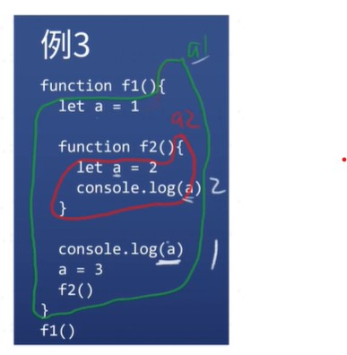

# js 函数

* 等于号右边的函数的作用域只在等于号右边
* 函数是对象

### 定义一个函数

1. 具名函数

```
function 函数名(形式参数1, 形式参数2){
  语句
  return 返回值
}
```
2. 匿名函数

* 上面的具名函数，去掉函数名就是匿名函数
```
let a = function(x, y){ return x+y }

也叫函数表达式
```
3. 箭头函数

```
let f1 = x => x*x 
let f2 = (x,y) => x+y // 圆括号不能省
let f3 = (x,y) => {return x+y} // 花括号不能省
let f4 = (x,y) => ({name:x, age: y}) 
直接返回对象会出错，需要加个圆括号（头疼）
```
3. 用构造函数
```
let f = new Function('x', 'y', 'return x+y')
```
* 基本没人用，但是能让你知道函数是谁构造的
* 所有函数都是 Function 构造出来的
* 包括 Object、Array、Function 也是
### 函数自身 V.S. 函数调用 ----fn V.S. fn()
1. 函数自身
```
代码
let fn = () => console.log('hi')
fn
```
* 结果
不会有任何结果
因为 fn 没有执行
2. 函数调用

```
代码
let fn = () => console.log('hi')
fn()
```
* 结果
打印出 hi
有圆括号才是调用
3. 代码
```
let fn = () => console.log('hi')
let fn2 = fn
fn2()
```
* 结果
* fn 保存了匿名函数的地址
* 这个地址被复制给了 fn2
* fn2() 调用了匿名函数
* fn 和 fn2 都是匿名函数的引用而已
* 真正的函数既不是 fn 也不是 fn2
## 函数的要素
* 每个函数都有这些东西
1. 调用时机
2. 作用域
3. 闭包
4. 形式参数
5. 返回值
6. 调用栈
7. 函数提升
8. arguments（除了箭头函数）
9. this（除了箭头函数

### 调用时机
1. 例一
```
代码
let a = 1
function fn(){
  console.log(a)
}
```

* 问打印出多少
* 答
不知，因为没有调用代码
2. 例二
```
代码
let a = 1
function fn(){
  console.log(a)
}
fn()
```

* 问打印出多少
* 答
1
3. 例三

```
代码
let a = 1
function fn(){
  console.log(a)
}

a = 2
fn()
```

* 问打印出多少
* 答
2
4. 例四

```
代码
let a = 1
function fn(){
  console.log(a)
}

fn()
a = 2
```
* 问打印出多少
* 答
1
5. 例五

```
代码
let a = 1
function fn(){
  setTimeout(()=>{
    console.log(a)
  },0)
}

fn()
a = 2
```
* 问打印出多少
* 答:2
* setTimeout----意思是尽快,
* 举个例子:你正在打游戏打到最后一关,你妈妈叫你吃饭,这个时候你说马上吃饭,说明你打完最后一关再去吃饭,而不是马上放下游戏去吃饭,
* 所以意思是,当你运行完再去打印fn()

6. 例六

```
代码
let i = 0
for(i = 0; i<6; i++){
  setTimeout(()=>{
    console.log(i)
  },0)
}
```
* 问打印出多少
* 答
* 不是 0、1、2、3、4、5
* 而是 6 个 6
* 当i=6的时候才会跳出for循环

7. 例7

```
代码
for(let i = 0; i<6; i++){
  setTimeout(()=>{
    console.log(i)
  },0)
}
```
* 问打印出多少
* 答
* 是 0、1、2、3、4、5
* 因为 JS 在 for 和 let 一起用的时候会加东西
* 每次循环会多创建一个 i（我服了 JS）

### 作用域
* 每个函数都会默认创建一个作用域
1.  例一
```
function fn(){
  let a = 1
}
console.log(a) // a 不存在
```
* 问
* 是不是因为 fn 没执行导致
* 答
* 就算 fn 执行了，也访问不到作用域里面的 a 
* a的作用域在往上找{往下找} ,用{}包起来的就是a的作用域
2. 例2
```
function fn(){
  let a = 1
}
fn()
console.log(a) // a 还是不存在
```
### 全局变量 V.S. 局部变量
* 在顶级作用域声明的变量是全局变量
* window 的属性是全局变量
* 其他都是局部变量

### 函数可嵌套----作用域也可嵌套
3. 例3

```
function f1(){
  let a = 1
  
  function f2(){
    let a = 2
    console.log(a)
  }

  console.log(a)
  a = 3
  f2()
}
f1()
```
* 

### 作用域规则
* 如果多个作用域有同名变量 a
* 那么查找 a 的声明时，就向上取最近的作用域
* 简称「就近原则」
* 查找 a 的过程与函数执行无关
* 但 a 的值与函数执行有关

5. 例4

```
function f1(){
  let a = 1
  function f2(){
    let a = 2
    function f3(){
      console.log(a)
    }
    a = 22
    f3()
  }
  console.log(a)
  a = 100
  f2()
}
f1()
```
* f3()下面的console.log(a)指的是 let a=2 , f3()打印出的值是a=22

### 闭包

```
重看例四
function f1(){
  let a = 1
  function f2(){
    let a = 2
    function f3(){
      console.log(a)
    }
    a = 22
    f3()
  }
  console.log(a)
  a = 100
  f2()
}
f1()
```
```
例四里面一段
let a = 2
    function f3(){
      console.log(a)
    }
```
* 如果一个函数用到了外部的变量
* 那么这个函数加这个变量
* 就叫做闭包
* 上边的 a 和 f3 组成了闭包
### 形式参数
1. 形式参数的意思就是非实际参数
```
function add(x, y){
  return x+y
}
// 其中 x 和 y 就是形参，因为并不是实际的参数
add(1,2)
// 调用 add 时，1 和 2 是实际参数，会被赋值给 x y
```
2. 形参可认为是变量声明

```
// 上面代码近似等价于下面代码
function add(){
  var x = arguments[0]
  var y = arguments[1]
  return x+y
```
* 形参可多可少,形参只是给参数取名字
* 
* argument意思是所有参数
### 返回值
1. 每个函数都有返回值
```
function hi(){ console.log('hi') }
hi()
没写 return，所以返回值是 undefined
```
```
function hi(){ return console.log('hi') }
hi()
返回值为 console.log('hi') 的值，即 undefined
```
* 函数执行完了后才会返回
* 只有函数有返回值
* 1+2 返回值不为3   
* 1+2 值为 3

* 
### 调用栈
1. 什么是调用栈
* JS 引擎在调用一个函数前
* 需要把函数所在的环境 push 到一个数组里
* 这个数组叫做调用栈
* 等函数执行完了，就会把环境弹(pop)出来
* 然后 return 到之前的环境，继续执行后续代码
2. 举例
* console.log(1)
* console.log('1+2的结果为' + add(1,2))
* console.log(2)
* 

### 递归函数
1. 阶乘
```
function f(n){
  return n !== 1 ? n* f(n-1) : 1
}
理解递归
f(4)
= 4 * f(3)
= 4 * (3 * f(2))
= 4 * (3 * (2 * f(1)))
= 4 * (3 * (2 * (1)))
= 4 * (3 * (2))
= 4 * (6)
24
先递进，再回归
```
* 
### 递归函数调用栈
1. 递归函数的调用栈很长
* 请画出阶乘(6) 的调用栈
* 调用栈最长有多少(测试)
```
function computeMaxCallStackSize() {
  try {
    return 1 + computeMaxCallStackSize();
  } catch (e) {
    // 报错说明 stack overflow 了
    return 1;
  }
}
```
* Chrome 12578
* Firefox 26773
* Node 12536

### 爆栈
* 如果调用栈中压入的帧过多，程序就会崩溃
## 函数提升
1. 什么是函数提升
* function fn(){}
* 不管你把具名函数声明在哪里，它都会跑到第一行
2. 什么不是函数提升
* let fn = function(){}
* 这是赋值，右边的匿名函数声明不会提升


### this默认指向window,如果不给任何条件
### 如果传的this不是对象,那么js就会自动帮你封装成对象
### 所用函数调用必须用大师写法 

## arguments 和 this----每个函数都有，除了箭头函数
1. 代码

```
function fn(){
  console.log(arguments)
}
```
2. 如何传 arguments
* 调用 fn 即可传 arguments
* fn(1,2,3) 那么 arguments 就是 [1,2,3] 伪数组
3. 如何传 this
```
function fn(){

  console.log(this)
}
```
* 目前可以用 fn.call(xxx, 1,2,3) 传 this 和 arguments
* 而且 xxx 会被自动转化成对象（JS 的糟粕）

### 可以这么理解 ----this 是隐藏参数,arguments 是普通参数

### 假设没有this
1. 
```
 代码
let person = {
  name: 'frank',
  sayHi(){
    console.log(`你好，我叫` + person.name)
  }
}
```
2. 分析
* 我们可以用直接保存了对象地址的变量获取 'name'
* 我们把这种办法简称为引用

### 问题一
```
 代码
let sayHi = function(){
  console.log(`你好，我叫` + person.name)
}
let person = {
  name: 'frank',
  'sayHi': sayHi
}
```
* 分析
* person 如果改名，sayHi 函数就挂了
* sayHi 函数甚至有可能在另一个文件里面
* 所以我们不希望 sayHi 函数里出现 person 引用

### 问题2
代码
```
class Person{
  constructor(name){
    this.name = name 
    // 这里的 this 是 new 强制指定的
  }
  sayHi(){
    console.log(???)
  }
}
```
* 分析
* 这里只有类，还没创建对象，故不可能获取对象的引用
* 那么如何拿到对象的 name ？

### 需要一种办法拿到对象----这样才能获取对象的 name 属性
1. 用参数(土办法)

```
对象
let person = {
  name: 'frank',
  sayHi(p){
    console.log(`你好，我叫` + p.name)
  }
}
person.sayHi(person)
类
class Person{
  constructor(name){ this.name = name }
  sayHi(p){
    console.log(`你好，我叫` + p.name)
  }
}
```
2. python用了这种方法

```
python代码
class Person:
  def __init__(self, name): # 构造函数
    self.name = name

  def sayHi(self):
    print('Hi, I am ' + self.name)
person = Person('frank')
person.sayHi()
```
* 特点
*每个函数都接受一个额外的 self
* 这个 self 就是传进来的对象
* 只不过 Python 会偷偷帮你传对象
* person.sayHi() 等价于 person.sayHi(person)
* person 就被传给 self 了

3. js在每个函数里加了this

```
用 this 获取那个对象
let person = {
  name: 'frank',
  sayHi(){
    console.log(`你好，我叫` + this.name)
  }
}//sayhi()括号里有一个this,写的时候不用写
```
 * person.sayHi()
* 相当于
* person.sayHi(person)
* 然后 person 被传给 this 了（person 是个地址）

* 这样，每个函数都能用 this 获取一个未知对象的引用了

* person.sayHi()会隐式地把 person 作为 this 传给 sayHi..方便 sayHi 获取 person 对应的对象
4. 总结

* 我们想让函数获取对象的引用
* 但是并不想通过变量名做到
* Python 通过额外的 self 参数做到
* JS 通过额外的 this 做到：
* person.sayHi() 会把 person 自动传给 sayHi, sayHi 可以通过 this 引用 person
* 其他
* 注意 person.sayHi 和 person.sayHi() 的区别
* 注意 person.sayHi() 的断句 (person.sayHi) ( )
### 一个问题
  1. 
```
到底哪个对
let person = {
  name: 'frank',
  sayHi(this){
    console.log(`你好，我叫` + this.name)
  }
}
1. person.sayHi()
2. person.sayHi(person)
```
* 省略形式反而对了，完整形式反而是错的？
* JS 怎么解决这种不和谐
* 提供两种调用形式
2. 两种调用方法
*  小白调用法
* person.sayHi()
* 会自动把 person 传到函数里，作为 this
* 大师调用法
* person.sayHi.call(person)
* 需要自己手动把 person 传到函数里，作为 this
* 应该学习哪种？
* 学习大师调用法，因为小白调用法你早就会

3. 例1
```
function add(x,y){
  return x+y
}
```
* 没有用到 this
* add.call(undefined, 1,2) // 3
* 为什么要多写一个 undefined
* 因为第一个参数要作为 this
* 但是代码里没有用 this
* 所以只能用 undefined 占位
* 其实用 null 也可以

4. 例4

```
Array.prototype.forEach2 = function(fn){
  for(let i=0;i<this.length;i++){
    fn(this[i], i, this)
  }
}
```
* this 是什么
* 由于大家使用 forEach2 的时候总是会用 arr.forEach2
* 所以 arr 就被自动传给 forEach2 了
* this 一定是数组吗
* 不一定，比如
* Array.prototype.forEach2.call({0:'a',1:'b'})

### this两种使用方法
1. 隐式传递

```
fn(1,2) // 等价于 fn.call(undefined, 1, 2)
obj.child.fn(1) // 等价于 obj.child.fn.call(obj.child, 1)
```
2. 显示传递
```
fn.call(undefined, 1,2)
fn.apply(undefined, [1,2])
```
### 绑定this
1. 使用 .bind 可以让 this 不被改变
```
function f1(p1, p2){
  console.log(this, p1, p2)
}
let f2 = f1.bind({name:'frank'})
// 那么 f2 就是 f1 绑定了 this 之后的新函数
f2() // 等价于 f1.call({name:'frank'})
```
2. .bind 还可以绑定其他参数
```
let f3 = f1.bind({name:'frank'}, 'hi')
f3() // 等价于 f1.call({name:'frank'}, hi)
```
### 箭头函数----没有 arguments 和 this
*  里面的 this 就是外面的 this
* console.log(this) // window
* let fn = () => console.log(this) 
* fn() // window
* 就算你加 call 都没有
* fn.call({name:'frank'}) // window
### 总结
* 每个函数都有这些东西
* 调用时机
* 作用域
* 闭包
* 形式参数
* 返回值
* 调用栈
* 函数提升
* arguments（除了箭头函数）
* this（除了箭头函数）
### 立即执行函数----只有 JS 有的变态玩意，现在用得少
1. 原理
* ES 5 时代，为了得到局部变量，必须引入一个函数
* 但是这个函数如果有名字，就得不偿失
* 于是这个函数必须是匿名函数
* 声明匿名函数，然后立即加个 () 执行它
* 但是 JS 标准认为这种语法不合法
* 所以 JS 程序员寻求各种办法
* 最终发现，只要在匿名函数前面加个运算符即可
* !、~、()、+、- 都可以
* 但是这里面有些运算符会往上走
* 推荐永远用 ! 来解决


