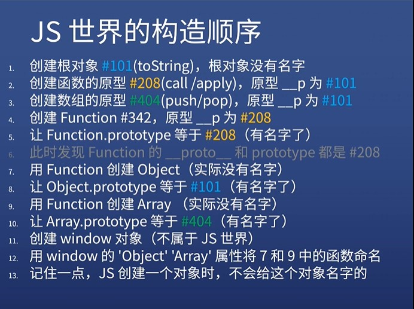
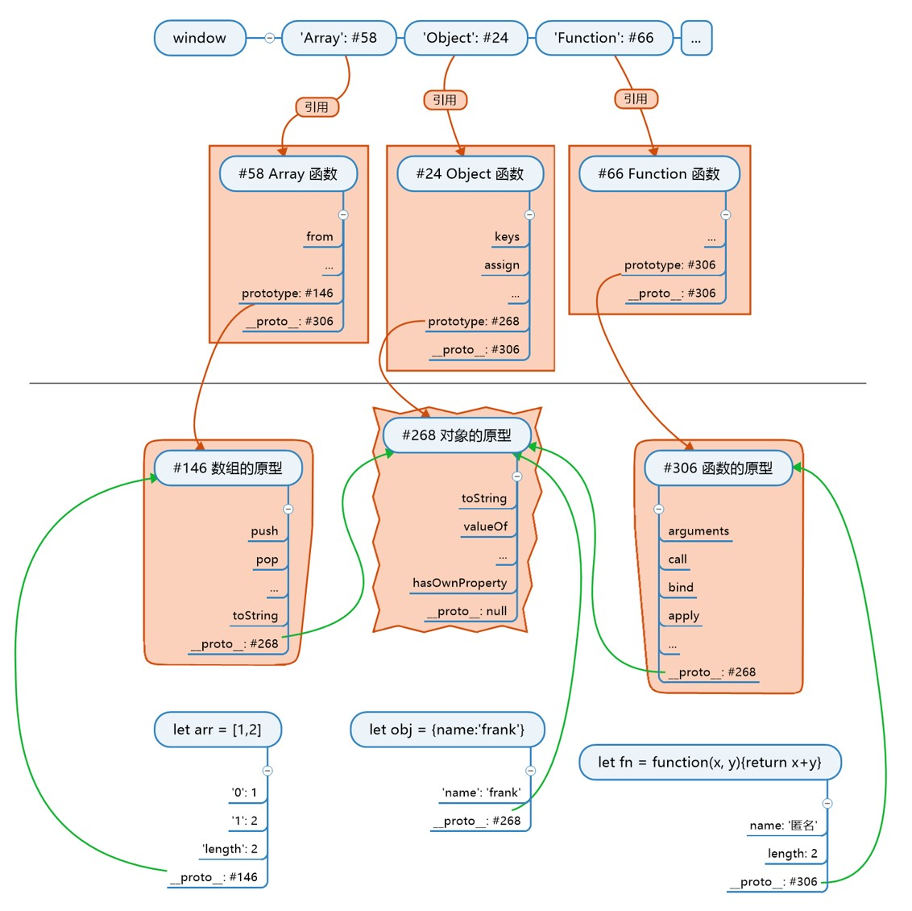

# 知识点
1. 基本概念

* 内存,变量,数据类型,对象 

2. 控制语句

* if else
* for

3. 对象

* 原型,原型链
* 对象分类
* new一个新对象
* 构造函数
* this的隐式传递和显式传递

## 难点
1. js三座大山

* 原型
* this
* ajax

### 最重要的知识
* 对象.__proto __ == 其构造函数.prototype
* js唯一公式,如果不会就套公式

2. 根公理

* Object.prototype是所有对象的(直接或渐渐)原型
* 加了直接或者间接,所谓公理就是规 定好的
  3. 函数公理

* 所有函数都是由Function构造的
* 任何函数.__proto_ _ ===Function.prototype
* 任意函数有Object/Array/Function
### 拨乱反正
1.  XXX 的原型
* {name:'frank'} 的原型
* [1,2,3] 的原型
* Object 的原型
2. 解读
* Object 的原型是 Object.__proto __：对
* Object 的原型是 Object.prototype ：错
3. 错在哪
* 「的原型」等价于「.__proto __」
* 中文的「原型」无法区分 __proto __ 和  prototype
* 所以我们只能约定，原型默认表示 __proto __ 
* 只不过 __proto __ 正好等于某个函数的 prototype
### 乱2
1. 我觉得老师你矛盾了
* [1,2,3] 的原型是 Array.prototype
* 你有说 Object.prototype 是所有对象的原型
* 那为什么 Object.prototype 不是 [1,2,3] 的原型
2. 错在哪
* 原型分两种：直接原型和间接原型
* 对于普通对象来说，Object.prototype 是直接原型
* 对于数组、函数来说，Object.prototype 是间接原型
### 乱三
1. Object.prototype 不是根对象
理由
* Object.prototype 是所有对象的原型
* Object 是 Function 构造出来的
* 所以，Function 构造了 Object.prototype
* 推论，Function 才是万物之源啊！
2. 错在哪
* Object.prototype 和 Object.prototype 对象的区别
* 对象里面从来都不会包含另一个对象
* 接下来我们要把 JS 世界的建造顺序理清楚

### js构造顺序

2. 续

* 用 new Object() 创建 obj1
* new 会将 obj1 的原型 __p 设置为 Object.prototype，也就是 #101
* 用 new Array() 创建 arr1
new 会将 arr1 的原型 __p 设置为 Array.prototype，也就是 #404
* 用 new Function 创建 f1
* new 会将 f1 的原型 __p 设置为 Function.prototype，也就是 #208
3. 续

* 自己定义构造函数 Person，函数里给 this 加属性
* Person 自动创建 prototype 属性和对应的对象 #502
* 在 Person.prototype #502 上面加属性
* 用 new Person() 创建对象 p
* new 会将 p 的原型 __p 设为 #502
### 

## 总结
1. 构造函数
* 是用来构造对象的
* 会预先存好对象的原型，原型的原型是根
* new 的时候将对象的 __p 指向原型
2. 对象
* 所有对象都直接或间接指向根对象
* 如果对象想要分类，就在原型链上加一环
* 用构造对象可以加这一环
3. 思考
* 如果加了一环之后，想再加一环怎么办

