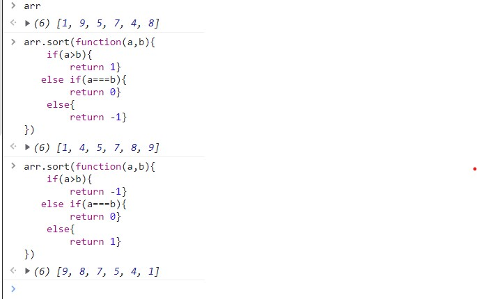
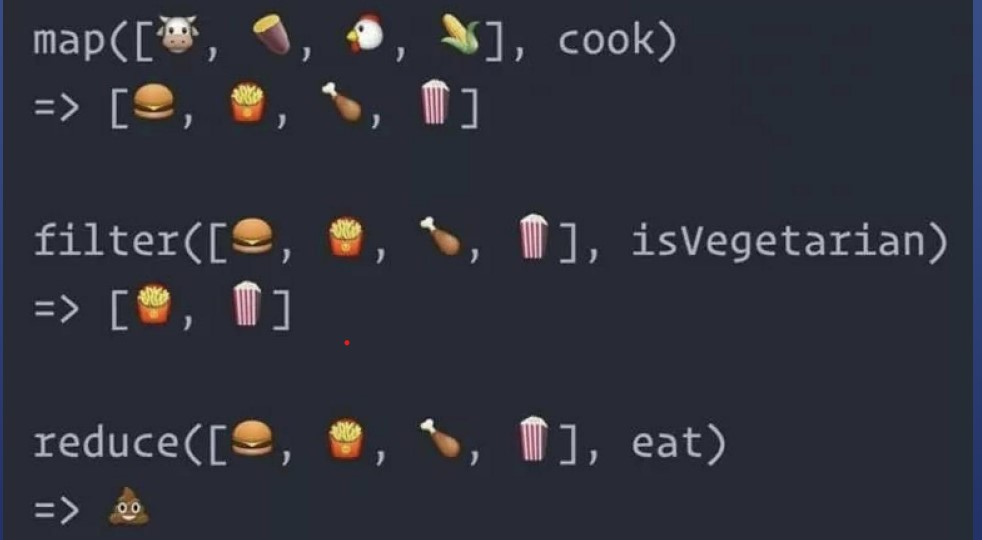

# js数组
### js的数组
* 元素的数据类型可以不同
* 内存不一定是连续的(对象随机存储)  
* 不能通过数字下标,而是通过字符串下标
* 意味着数组可以有任意key
* 比如

```
let arr = [1,2,3]
arr['xxx']=1
```
* 

### 创建一个数组
1. 新建

* let arr = [1,2,3]
* let arr = new Array(1,2,3)
* let arr = new Array(3)

2. 转化

* 
```
let str = '1,2,3'
str.split(',')-----用,分割数组
let str2 = '123'
str2.split('')//用.分割数组,等价于
Array.from('123')//等价于
Array.from({0:'a',1:'b',2:'c',lenth:3})//有0,1,2的下标,并且有length可以变成数组
```
3. 伪数组

* let divList =document.querySelector('div')
*伪数组的原型链中并没有数组的原型(即数组的共有属性push等) 
4. 合并两个数组,得到新数组

* arr1.concat(arr2)

5. 截取一个数组的一部分

* arr1.slice(1)//从第二个元素开始
* arr.slice(0)//全部截取
* 注意,js只提供浅拷贝
* let arr2 = arr.slice(0)//拷贝一个数组

### 删元素
1. 和对象一样

```
let arr = ['a','b','c']
delete arr ['0']
arr
[empty,'b','c']//发现数组的长度没有变----可以叫做稀疏数组
```
2. 如果直接改length可以删元素吗

```
let arr = [1,2,3,4,5]
arr.length=1
```
* 可以但是不要随便改length

3. 正确删元素

* 删除头部元素

``` 
arr.shift()//arr被修改,并返回被删元素
```
* 删除尾部元素
```
arr.pop()//arr被修改,并返回被删元素
```
* 删除中间元素

```
arr.splice(index,1)//删除index的一个元素
arr.splice(index,1,'x')//并在删除位置添加'x'
arr.splice(index,1,'x','y')//并在删除位置添加'x'和'y'
```
* 

4. 查看所有元素

* 查看所有属性名

```
let arr=[1,2,3,4,5];arr.x='xxx'
Object.ket(arr)//查看所有属性
for(let key in arr){console.log(`${key}:${arr[key]}`)}
```
* 查看数字(字符串)属性名和值

```
for(let i=0; i<arr.length; i++){
    console.log(`${i}:${arr[i]}`)
}
自己让i从0增长到length-1
arr.foreach(function(item,index){
    console.lo(`${index}:${item}`)
})
```
* 也可以用forEach/map等原型上的函数

6. forEach是一个槛

* 自己写forEach才能理解forEach

```
function forEach(array,fn){
    for(let i = o;i < array.length;i++){
        fn(array[i],i,array)
    }
}
```
* forEach用for访问array的每一项
* 对每一项调用fn(array[i],i,array)
* 为什么要传入array?规定如此

### 查看单个属性

1. 跟对象一样

* let arr=[111,222,333]
* arr[0]

2. 索引越界

* arr[arr.length]===undefing
* arr[-1]===undefined

3. 举例

```
for (let i=0;i<=arr.length;i++){
    console.log(arr[i].toString())
}//<=报错

```
* 报错:Cannot read pr operty 'toString'of undefined//有可能数组越界,意思是你读取了undefined的toString属性,不是toStiring是undefined,而是x.toString()其中x如果是undefined就报这个错 

#### 查看单个属性(item表示值)
1. 查找某个元素是否在数组里

* arr.indexOf(item)//存在返回索引,不存在返回-1

2. 使用条件查找元素

```
 arr.find(item=>item%2===0)//找第一个偶数
 arr.find(function(item){
     return item%2===0
 })//等价于
 ```
 3. 使用条件查找元素的索引

```
arr.findIndex(item=>item%2===0)//找到第一个偶数的索引
```
* 

### 增加数组中的元素(index----索引)

1. 在尾部加元素

```
arr.push(newitem)//修改arr,返回新长度
arr.push(iten1,item2)//修改arr,返回新长度
```
2. 在头部加元素

```
arr.unshift(newitem)//修改arr,返回新长度
arr.unshift(item1,item2)//修改arr,返回新长度
```
3. 在中间添加元素

```
arr.splice(index,0,'x')//index处插入'x',0的意思是index处不做修改,变成1的话就是删除index处
arr.splice(index,0,'x','y')
```
* 

### 修改数组中的元素
1. 反转顺序

* arr.reverse()//修改原数组

* 

2. 自定义顺序

* arr.sort((a,b)=>a-b)
* 
* 图中有等价方法

### 数组变换
1. map

* n变n

2. fliter

* n变少

3. reduce

* n变1

* 
* reduce里面的0是sum的初始值
* //结果的初始值是0,每一次sum和当前的item进行+操作,并把操作后的值作为下一次的结果返回(return)
* 

2. 用reduce代替map

* 
* 