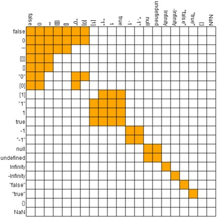
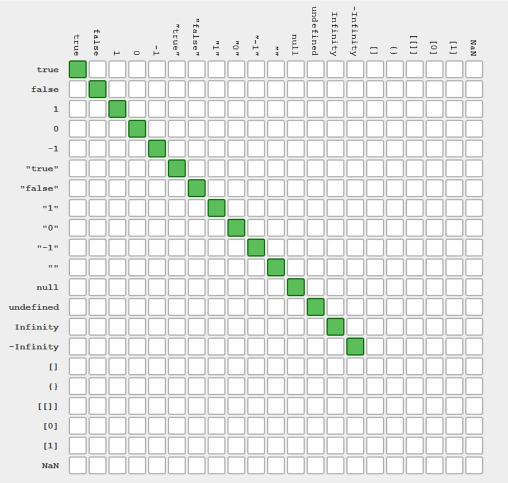
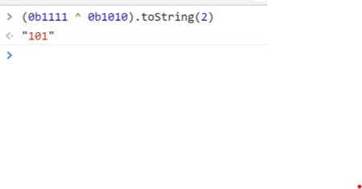
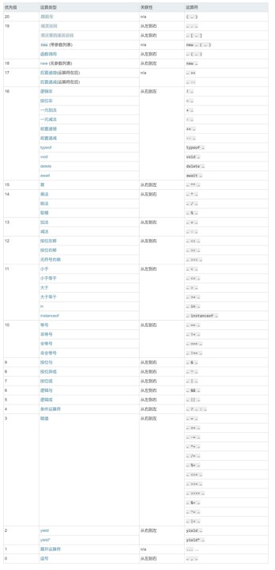

# js运算符
## 算数运算符
1. number 运算

* 加减乘除
* 余数 x % 7
* 指数 x ** 3
* 自增自减 x++ / ++x /x--/--x(x在前,值取前,x在后,值取后)
* 求值运算符 +x(+只是)
* 负数运算符 -x(正数变成负数,负数变正数)

2. string 运算

* 连接运算 '123'+'456'

* 尽量少用自增自减----因为你和别人都容易记错
* 不同类型的不要加起来(把1和'2'加起来啥意思)一个数字加一个字符串,js会先把数字变成字符串,一个字符串减一个数字,由于字符串不支持减,js会把字符串变成数字
3. 比较运算符

* >
* <
* >=
* <=
* ==
* ! =
* ===
* ! ==

4. js三位一体

* 0 == []
* 0 == '0'
* 0 == '\t'
* 但是右边三个互不相等
* 忠告:永远不要用==,用===代替,==问题在于,总是自作聪明(自动类型转换)

5. x == y 真值表

* 
* 令人难以理解的
* []==false 但不是falsy
* []==false 但{}却不是
* [[]] == false

6. x === y 真值表

* 
* [] ! == []空数组
* ({}) ! == ({})----空对象
* NaN !== NaN (唯一特例,强行记忆)

7. 布尔运算符

* 或且非
* ||
* &&
* !
* 短路逻辑
* console && console.log && console.log('hi') (如果console存在console.log也存在执行console.log('hi'))
* 以防console 不存在报错
* a = a || 100(a如果存在就等于a如果不存在就等于100)
* a的保底值

8. 二进制运算符

* 或,与,否
* | 两个位都为0,则结果为0,否则为1
* &
* ~
* 异或
* ^
* 两个位相同则结果为0,否则为1
* 
* 左移右移
* <<和>>
* 
* 头部补零的右移运算符
* >>>
* 工作很少用
* 参考[位运算符在js中的妙用](https://juejin.cn/post/6844903568906911752)
9. 使用与运算符判断奇偶

* 代码
* 偶数 & 1 = 0
* 奇数 & 1 = 1

10. 使用~, >>, <<, >>>, |来取整
* 代码
* console.log(~~ 6.83)    // 6
* console.log(6.83 >> 0)  // 6
* console.log(6.83 << 0)  // 6
* console.log(6.83 | 0)   // 6
* console.log(6.83 >>> 0)   // 6

11. 使用^来交换 a b 的值
* 代码
```
var a = 5
var b = 8
a ^= b
b ^= a
a ^= b
console.log(a)   // 8
console.log(b)   // 5
```
12. 位运算用得很少容易忘
13. 其他运算符4
14. 点运算符
* 语法
* 对象.属性名 = 属性值
* 作用
* 读取对象的属性值
* 有个疑问
* 不是对象，为什么也可以有属性？'a-b-c'.split('-')
* JS 有特殊逻辑，点前面不是对象，就把它封装成对象
* number 会变成 Number 对象
* string 会变成 String 对象
* bool 会变成 Boolean 对象
* 程序员从来不用这三种对象，只用简单类型
15. void运算符

* 语法
* void 表达式或语句
* 作用
* 求表达式的值，或执行语句
* 然后 void 的值总是为 undefined
* 需求
```
<a href="http://example.com" onclick="f(); return false;">点击</a>
return 假值可以阻止默认动作
<a href="javascript: void(f())">文字</a>
改用 void 可以炫技
```
16. 逗号表达式

* 语法
* 表达式1, 表达式2, ..., 表达式n
* 作用
* 将表达式 n 的值作为整体的值
* 使用
* let a = (1,2,3,4,5)
* 那么 a 的值就是 5，奇葩吧？
* let f = (x) => (console.log('平方值为'), x*x)
* 注意上面的括号不能省

17. 运算符优先级
* 不同运算符
```
1 + 2 * 3 是 (1 + 2) * 3 还是 1 + (2 * 3)----先算×
! a === 1 是 (! a) === 1 还是 ! (a === 1)
new Person().sayHi() 是什么意思
```
* 相同运算符
* 从左到右 a + b + c  
* 从右到左 a = b = c = d
* 优先级就是先算什么后算什么
* 具体规则想知道吗？
* 你：想。
* 不，你不想！看看[这里](https://developer.mozilla.org/zh-CN/docs/Web/JavaScript/Reference/Operators/Operator_Precedence#Table)就知道为什么。

18. 优先级汇总

* 汇总表位于 MDN
* 一共有20个运算符
* 怎么记忆呢
* 技巧
* 圆括号优先级最高(想先算哪个就加上括号)
* 会用圆括号就行
* 其他一律不记
* 
### 面试技巧
* 本节课有两个推荐大家不学
* == 不学
* 优先级不学
* 面试遇到怎么办
* 向面试官说明为什么不学，以及你的态度
* 如果面试官非要你答，直接跳过
* 跳过不影响面试表现吗？你可以在其他题表现
* 没必要在这种烂题上表现

### 不要用== ++(除了for循环的时候) newNumber()
